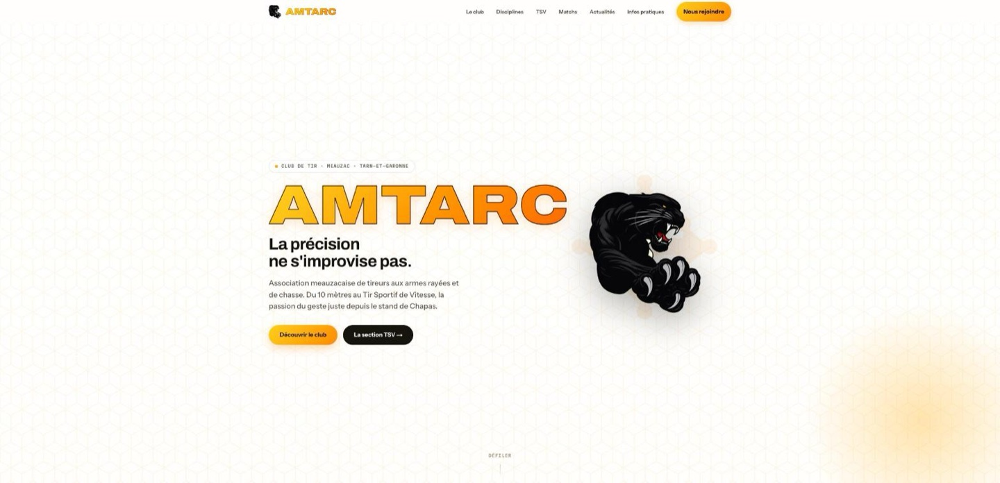

# AMTARC — website



Website for **AMTARC** (Association Meauzacaise de Tireurs aux Armes Rayées et de Chasse), a
sports-shooting club in Meauzac (Tarn-et-Garonne, France).

This is a **from-scratch rewrite in ASP.NET Core (.NET 10)** of the club's site, which previously
ran as a Next.js + NestJS monorepo (`github.com/supremjerem/amtarc`, now archived). The rewrite
drops the match-booking feature entirely — that moves to a separate WordPress module the site links
out to — and consolidates the two services into one deployable.

## Stack

- **ASP.NET Core 10 / C#**, Razor Pages for the public page and the `/admin` back-office.
- **EF Core 10 + Npgsql**, PostgreSQL.
- **Cookie authentication** for the single admin account (bcrypt).
- **Tailwind CSS v4** (CSS-first, compiled by the Tailwind CLI at build time) + a small bundled
  **TypeScript** file for the page's DOM effects. No client framework.
- One Docker image, deployed behind Traefik on a VPS.

## What it does

- **Public site** — a single scrolling page: hero, club announcements, club stats, disciplines,
  the "TSV / notre signature" showcase, a news teaser, practical info, and contact.
- **News** — published items listed newest-first on the home page; full CRUD in the admin.
- **Editable content** — four page sections (hero, announcements, practical info, contact) are
  editable from the admin and stored as JSON, merged over built-in defaults at render time.
- **Admin back-office** — cookie-authenticated, at `/admin`: news CRUD, the four editable sections,
  and image upload.

## Requirements

- .NET SDK 10 (`global.json` pins the exact band)
- PostgreSQL 16 (local: `docker compose up -d`)
- Node.js 22+ (build-time only — compiles the CSS and the TypeScript bundle; not needed at runtime)

## Getting started

```bash
dotnet restore

# start Postgres
docker compose up -d

# run the app (applies EF migrations on startup, seeds the admin from env)
dotnet run --project src/Amtarc.Web
```

- App: http://localhost:5xxx (see `src/Amtarc.Web/Properties/launchSettings.json`)
- Health check: `GET /healthz`
- Admin: `/admin/login` — credentials come from `Admin__Email` / `Admin__Password`
  (see `.env.example`). Each start re-applies the password hash, so changing the value and
  restarting is how you rotate it.

## Scripts / common commands

- `dotnet build -c Release` — build (warnings are errors)
- `dotnet test -c Release` — run the xUnit suite with coverage
- `dotnet format` — apply the `.editorconfig` style rules (`--verify-no-changes` to check)
- `dotnet ef migrations add <Name> --project src/Amtarc.Web` — add a schema migration

## Architecture

One ASP.NET Core project (`src/Amtarc.Web`), organised by folder + namespace rather than split into
assemblies: `Domain/` (entities), `Data/` (EF `DbContext` + migrations), `Services/` (business
logic behind interfaces), `Content/` (the C# port of the site's default copy + section field
config), `Pages/` (Razor Pages — `Pages/Admin/` for the back-office), `Security/`,
`Infrastructure/`, `Options/`. A single xUnit project (`tests/Amtarc.Web.Tests`) with unit tests
and `WebApplicationFactory` integration tests.

The public page is served from an output cache tagged `news` + `content`; admin writes evict those
tags — there is no cross-service cache-bust webhook. Startup validates configuration and refuses to
boot on missing/short/placeholder secrets.

Significant decisions are recorded as ADRs in [`docs/adr/`](docs/adr):

- [0001 — Rewrite the site as a single ASP.NET Core app](docs/adr/0001-rewrite-in-aspnet-core.md)
- [0002 — Cookie authentication for the single admin account](docs/adr/0002-cookie-auth-for-the-single-admin.md)

## Roadmap

Seeded from the rewrite plan. One PR per phase into `develop`.

- [x] **Phase 0** — De-risking spike: .NET 10 / EF Core 10 tooling; Tailwind v4 standalone CLI
      parity with the old PostCSS build; Archivo variable font ships the `wdth` axis
- [x] **Phase 1** — New repo, solution scaffold, CI (format + build + test + coverage), CodeQL,
      Dependabot, branch protection
- [x] **Phase 2** — EF data layer: `News`, `SiteContent`, `Admin` + the `NewsCategory` PG enum;
      `Initial` migration reproducing the old Postgres shape (table/column/index/constraint names,
      `timestamp(3)`); startup `Database.Migrate()` + env-driven admin seed; `SlugGenerator` +
      `NewsService.FindPublishedAsync` / `GenerateUniqueSlugAsync`; Testcontainers integration tests
- [ ] **Phase 3a** — Design-system foundation: port `globals.css`, self-host the 3 fonts, wire the
      Tailwind + esbuild build, `site.ts` DOM effects, public layout
- [ ] **Phase 3b** — The 8 homepage sections + Nav + Footer, copy-identical to the old site
- [ ] **Phase 4** — Cookie authentication, `/admin` gated, login rate-limited
- [ ] **Phase 5** — Admin: news CRUD, the four editable content sections, image upload
- [ ] **Phase 6** — OutputCache + tag eviction, rate limiting, security headers, options validation
      (refuse to boot on bad secrets)
- [ ] **Phase 7** — Test consolidation + coverage floor in CI
- [ ] **Phase 8** — Dockerfile (Node build stage → .NET publish → aspnet runtime), production
      `docker-compose.yml`, GHCR publish pipeline
- [ ] **Phase 9** — Data migration from the old production database (news + editable content +
      uploads)
- [ ] **Phase 10** — Staging deploy, parity check against the live site, Traefik cutover

Tracked deviations from the project standards, to close later:

- [ ] **Coverage floor in CI** — coverage is collected and uploaded, but the build does not yet fail
      below a threshold. Lands with Phase 7, once there is enough behaviour to set a meaningful bar.
- [ ] **Observability** — logging is structured via `ILogger`, but there are no metrics or tracing
      yet. Worth an OpenTelemetry pass once the app is deployed.
- **Branch protection requires 0 approving reviews** (CI must still pass, `main` takes no direct
  pushes). Deliberate: this is a single-maintainer repo and GitHub forbids approving your own pull
  request, so requiring one review would block every merge. Revisit if a second maintainer joins.

## Development workflow

- `main` is protected and always deployable; day-to-day work happens on `develop` (or feature
  branches based on it) and reaches `main` only through reviewed pull requests with green CI.
- [Conventional Commits](https://www.conventionalcommits.org).

## License

© AMTARC. All rights reserved. The source is public for transparency; it is not licensed for reuse.
